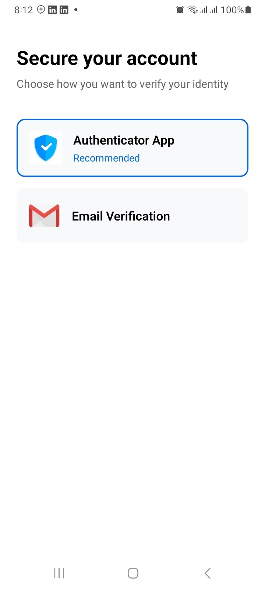
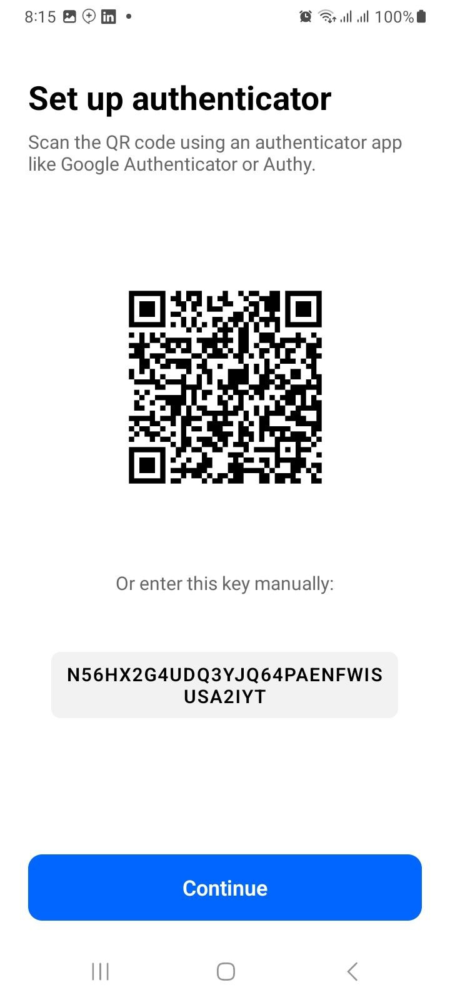
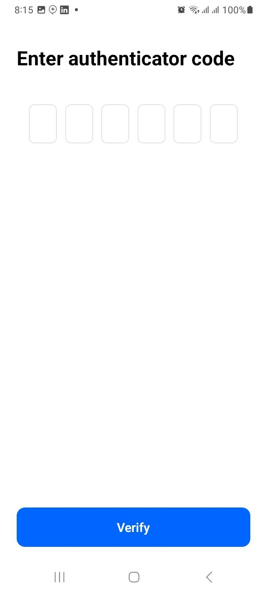
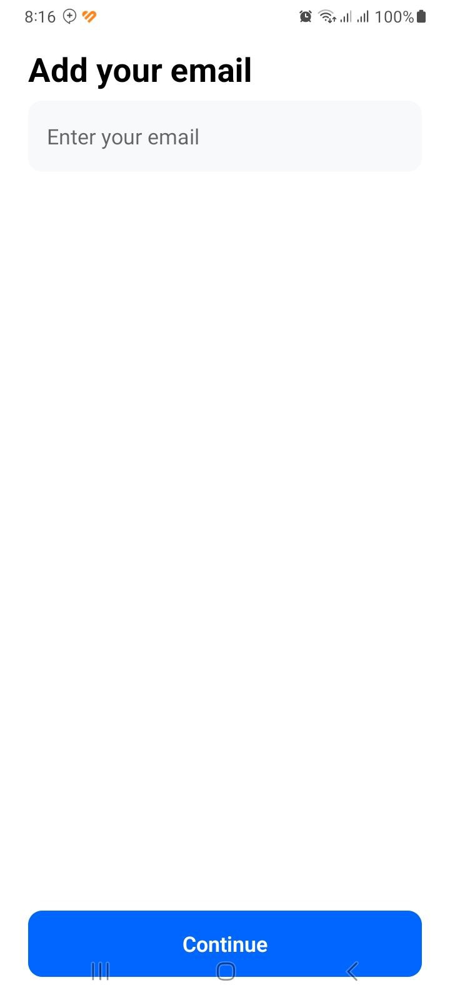
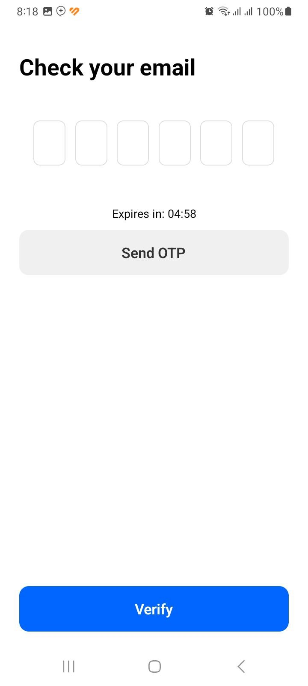
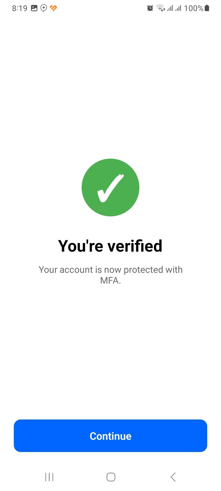

# OpenAuth Frontend

[](https://www.npmjs.com/package/@openauthdev/sdk)
[](https://www.npmjs.com/package/@openauthdev/cli)
[](https://www.npmjs.com/package/@openauthdev/ui)
[](LICENSE.md)

 
OpenAuth is a **developer-first authentication toolkit** that provides:

-  **CLI tools** for managing authentication projects and applications  
- **SDK functions** for interacting with the OpenAuth backend  
- Optional **React Native UI components** for MFA flows  

It enables seamless integration of **Multi-Factor Authentication (MFA)** using:
- **TOTP (Authenticator Apps)**
- **Email-based One-Time Passwords (OTP)**

---
Backend Code Base : https://github.com/amanuelcm27/openauth-backend

## Table of Contents

- [Architecture Overview](#architecture-overview)
- [CLI Features](#cli-features)
  - [Installation](#cli-installation)
  - [Developer Registration](#developer-registration)
  - [Creating an Application](#creating-an-application)
- [SDK Usage](#sdk-usage)
  - [TOTP (Authenticator App) Flow](#TOTP-Flow)
  - [Email OTP Flow](#Email-OTP-Flow)
  - [MFA Status Check](#MFA-Status-Check)
- [UI Components (Optional)](#ui-components-optional)
- [Available Screens](#Available-Screens)
- [License](#license)

---
## Quick setup


```
npm install @openauthdev/sdk
npm install @openauthdev/ui
npm install -g @openauthdev/cli # if you want the command openauth to be global

```
---

## Architecture Overview

OpenAuth is designed with **clear separation of concerns**:


- **CLI** → Used once during setup and administration  
- **SDK** → Used programmatically inside applications  
- **UI** → Optional, reusable MFA screens (can be replaced with custom UI)

---

## CLI Features

The **OpenAuth CLI** is the first step for developers integrating OpenAuth MFA.  
It is used to:

- Register a developer account
- Create and manage authentication-enabled applications
- Securely generate keys required by the SDK and frontend

The CLI is typically used **once during setup**, not inside production code.

---

### CLI Installation

The OpenAuth CLI is distributed via npm.

#### Requirements
- **Node.js v20+**
- **react-native-safe-area-context: ^5.6.2**

#### Install globally

```bash
npm install -g @openauthdev/cli
```

After installation, the `openauth` command will be available globally:

```bash
openauth
```

You should see:

```text
OpenAuth CLI

Usage:
openauth register
openauth create-app
```

---

### Developer Registration

Before creating apps, you must register as a developer.

This creates a **Developer Account** and issues a **Developer API Key**.

#### Command

```bash
openauth register
```

#### Interactive Prompts

You will be asked for:

```text
Developer name ( individual or company ):
Developer email:
Password:
```

#### Output

On success, you will receive:

* ✅ Confirmation of registration
* 🔑 **Developer API Key**

Example:

```text
✅ Developer registered successfully
🔑 Developer API Key:
⚠️ Warning : Save this Developer API key securely. It will not be shown again.
sk_dev_********************************
```

> ⚠️ **Important**
> The Developer API Key is shown **only once**.
> You will need it to create and manage apps. Store it securely.

---

### Creating an Application

Once registered, you can create an application that will use OpenAuth MFA.

Each application gets its **own App Secret Key**, which is later used by:

* The SDK
* Frontend (React Native or custom UI)

#### Command

```bash
openauth create-app
```

#### Interactive Prompts

```text
Developer API Key:
App name:
```

* **Developer API Key** → obtained during registration
* **App name** → any identifier (e.g. `XYZ-mobileapp`)

#### Output

On success:

```text
✅ App created successfully
🔐 App Secret Key:
sk_app_********************************

📌 Save this in your frontend environment:
OPENAUTH_APP_SECRET=sk_app_********************************
```

---

### Environment Configuration

The generated **App Secret Key** must be exposed to your frontend or backend
(depending on your integration strategy).

Example for frontend environments:

```env
OPENAUTH_APP_SECRET=65061fec52b71649d4490807985c3dad198003fe92eb870a3a77b2327160925d
```

Example for React Native (Expo):

```env
EXPO_PUBLIC_OPENAUTH_APP_SECRET=65061fec52b71649d4490807985c3dad198003fe92eb870a3a77b2327160925d
```

> 🔐 **Security Note**
> Treat the App Secret Key like a password.
> Do **not** commit it to source control.

---

### CLI Workflow Summary

A typical OpenAuth setup looks like this:

    1. Install the CLI
    2. Register as a developer
    3. Create an application
    4. Save the generated keys
    5. Integrate the SDK and UI components

---

## SDK Usage

The **OpenAuth SDK** is used inside your application to programmatically enable and verify **Multi-Factor Authentication (MFA)** for your users.

It provides support for:

* 🔐 **TOTP (Authenticator Apps)**
* 📧 **Email One-Time Passwords (OTP)**

The SDK communicates securely with the OpenAuth backend using your **App Secret Key**.

---

### SDK Installation

Install the SDK via npm:

```bash
npm install @openauthdev/sdk
```

or with yarn:

```bash
yarn add @openauthdev/sdk
```

---

### Basic Usage

Import the SDK:

```ts
import { OpenAuth } from "@openauthdev/sdk";
```

Each SDK function requires:

* `externalUserId` → your internal user identifier
* `appSecret` → generated via the OpenAuth CLI

---

### User Identity (`externalUserId`)

OpenAuth does **not manage users**.

Instead, you link MFA to your existing users using an identifier you control:

```text
externalUserId = "user_12345"
```

This can be:

* Database user ID
* UUID
* Auth provider ID (Firebase, Clerk, custom auth, etc.)

---

## TOTP Flow

TOTP (Autheticator App ) allows users to authenticate using apps like:

* Google Authenticator
* Microsoft Authenticator
* Authy

---

### 1. Setup TOTP

Initiates TOTP enrollment and returns data required to display a QR code.

```
const result = await OpenAuth.setupTOTP(
  externalUserId,
  process.env.OPENAUTH_APP_SECRET
);
```

**Typical response includes:**
```
{
"success": True,
"secret_key": secret,
"qr_code_base64": qr_base64,
"otpauth_url": otpauth_url
}
```

Use this to display a QR code in your UI.

---

### 2. Verify TOTP Code

After the user scans the QR code and enters a 6-digit code:

```ts
const verified = await OpenAuth.verifyTOTP(
  externalUserId,
  otp,
  process.env.OPENAUTH_APP_SECRET
);
```
**Typical response includes:**

if successful the response will be 
```
{"success": True, "verified": True},
```
If Invalid OTP was submitted
```
{"success": False, "verified": False, "error": "Invalid TOTP code"}
```
---

## Email OTP Flow

Email OTP allows users to verify  using one-time codes sent to email.

---

### 1. Setup Email MFA

Initial setup that registers the user’s email for OTP delivery.

```ts
await OpenAuth.setupEmail(
  externalUserId,
  email,
  process.env.OPENAUTH_APP_SECRET
);
```
**Typical response includes:**


```
{
    "success": True,
    "message": "Email MFA setup completed"
}
```
---

### 2. Send Email OTP

Triggers delivery of a one-time code to the user’s email.

```ts
await OpenAuth.sendEmailOTP(
  externalUserId,
  process.env.OPENAUTH_APP_SECRET
);
```
**Typical response includes:**


```
{
 "success": True,
 "message": "OTP sent"
}
```
⚠️ **Important** : if this function is repeatedly called it will send codes  to the users email you register in the ``` OpenAuth.setupEmail ``` phase

---

### 3. Verify Email OTP

Verify the code entered by the user:

```ts
const verified = await OpenAuth.verifyEmailOTP(
  externalUserId,
  otp,
  process.env.OPENAUTH_APP_SECRET!
);
```
**Typical response includes:**


```
{
    "success": True,
    "verified": True
}
```


⚠️ **Important** : if this function is repeatedly called with same code it will not work as one email-otp will be invalidated after first use

---
## MFA Status Check

once TOTP or Email MFA has been setup either using ```OpenAuth.setupEmail``` or ```OpenAuth.setupTOTP``` you can check a certain users mfa status using the following :
```
await OpenAuth.getMFAStatus(
  externalUserId,
  process.env.OPENAUTH_APP_SECRET
);
```
this will give you the following response:

```
{
    "mfa_type": totp/email,
    "is_active": True/False
}
```
## Recommended MFA Flows

### Login Flow Example

```text
User logs in using your own process
→ Check if MFA enabled
→ Send OTP / Request TOTP
→ Verify OTP
→ Grant access
```

### Enrollment Flow Example

```text
User enables MFA
→ Setup TOTP or Email
→ Verify OTP
→ Mark MFA as active
```

---


---

## Error Handling

All SDK functions throw errors on failure.

Example:

```ts
try {
  await OpenAuth.verifyTOTP(userId, otp, appSecret);
} catch (err) {
  console.error("MFA verification failed", err);
}
```

## UI Components (Optional – React Native)

OpenAuth provides **optional, prebuilt React Native screens** to speed up MFA integration.

These components:

* Are **fully optional**
* Use the OpenAuth SDK internally
* Can be styled, replaced, or composed freely
* Follow common MFA UX patterns

> ✅ Recommended for teams that want a fast, secure, and consistent MFA flow

> ❌ Not required — you can build your own UI using the SDK directly

---

### UI Package Installation

```bash
npm install @openauthdev/ui
```

or

```bash
yarn add @openauthdev/ui
```

---

### Available Screens

The UI kit exports **6 reusable screens**:

```ts
import {
  MFAMethodSelectionScreen,
  TotpSetupScreen,
  TotpVerifyScreen,
  EmailSetupScreen,
  EmailVerifyScreen,
  VerifiedScreen,
} from "@openauthdev/ui";
```

| Screen                     | Purpose                                         |
| -------------------------- | ----------------------------------------------- |
| `MFAMethodSelectionScreen` | Let users choose TOTP or Email MFA              |
| `TotpSetupScreen`          | Display QR code & secret for authenticator apps |
| `TotpVerifyScreen`         | Verify TOTP codes                               |
| `EmailSetupScreen`         | Register user email for OTP                     |
| `EmailVerifyScreen`        | Verify email OTP                                |
| `VerifiedScreen`           | Confirmation screen after successful MFA        |

---

## Required Props

Most screens require the same core inputs:

| Prop                      | Description                   |
| ------------------------- | ----------------------------- |
| `appSecret`               | App Secret Key from CLI       |
| `externalUserId`          | Your internal user identifier |
| `onContinue / onVerified` | Navigation callback           |

Example:

```ts
<TotpSetupScreen
  appSecret={process.env.EXPO_PUBLIC_OPENAUTH_APP_SECRET!}
  externalUserId={user.id}
  onContinue={() => navigation.navigate("VerifyTOTP")}
/>
```

---
## Option UI Screens for React Native

|  |  |  |
| --- | --- | --- |
|  |  |  |
---

## Recommended MFA Flow (Using UI Kit)

### Enrollment Flow

```text
MFAMethodSelection
 → TOTP Setup / Email Setup
 → TOTP Verify / Email Verify
 → Verified Screen
```

### Login / Verification Flow

```text
TOTP Verify / Email Verify
 → Verified Screen
 → Continue to App
```

---

## Example: Method Selection

```tsx
<MFAMethodSelectionScreen
  onSelectTOTP={() => navigation.navigate("TotpSetup")}
  onSelectEmail={() => navigation.navigate("EmailSetup")}
/>
```

---

## Example: TOTP Flow

### Setup

```tsx
<TotpSetupScreen
  appSecret={appSecret}
  externalUserId={userId}
  onContinue={() => navigation.navigate("TotpVerify")}
/>
```

### Verify

```tsx
<TotpVerifyScreen
  appSecret={appSecret}
  externalUserId={userId}
  onVerified={() => navigation.navigate("Verified")}
/>
```

---

## Example: Email OTP Flow

### Setup Email

```tsx
<EmailSetupScreen
  appSecret={appSecret}
  externalUserId={userId}
  onContinue={() => navigation.navigate("EmailVerify")}
/>
```

### Verify Email OTP

```tsx
<EmailVerifyScreen
  appSecret={appSecret}
  externalUserId={userId}
  onVerified={() => navigation.navigate("Verified")}
/>
```

---

## Verified Screen

Use this screen to confirm successful MFA enrollment or verification:

```tsx
<VerifiedScreen onContinue={() => navigation.replace("Home")} />
```

---

## Styling & Customization

* All components use shared styles (`styles.ts`)
* You may:

  * Override styles
  * Fork components
  * Replace individual screens
  * Use SDK-only flows

> OpenAuth UI components are **reference implementations**, not constraints.

---

## When NOT to Use the UI Kit

You may want to skip the UI kit if:

* You need fully custom branding
* You already have OTP input components
* You’re integrating MFA into a backend-only flow

In those cases, use **@openauthdev/sdk directly**.

---

## Architecture Recap

```text
CLI → Keys & Apps
SDK → MFA Logic
UI → Optional UX Layer
```
---


## License

This project is licensed under the [MIT License](LICENSE.md) - see the LICENSE.md file for details.

